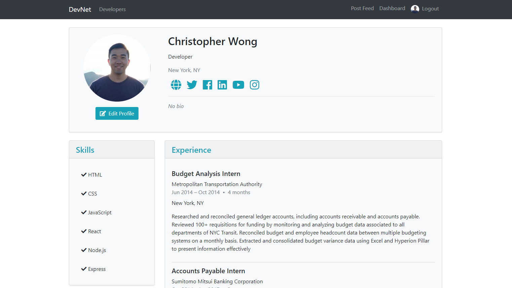
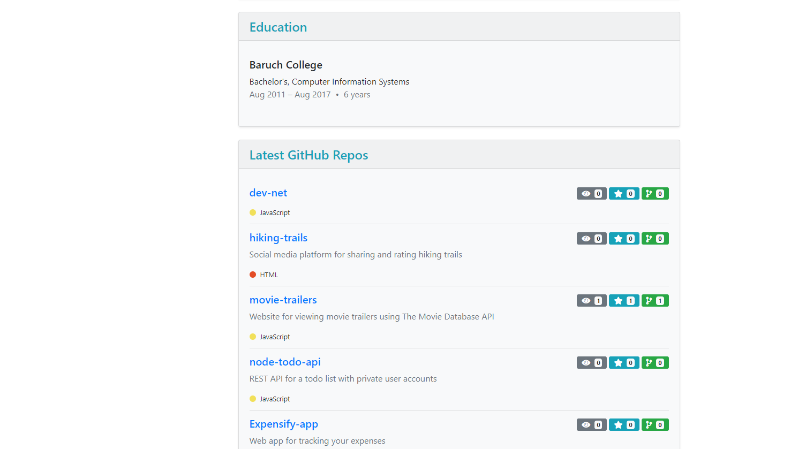
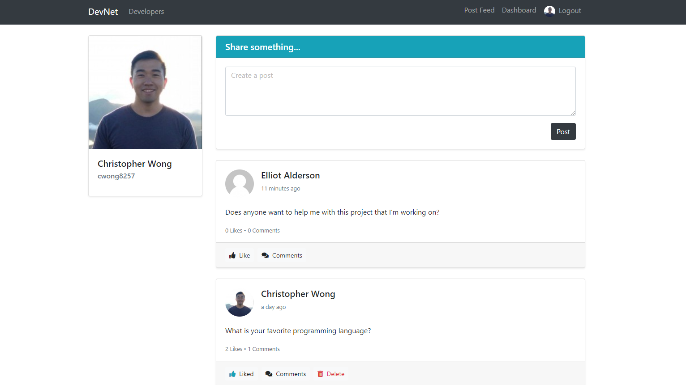

# DevNet

[DevNet](https://polar-atoll-40700.herokuapp.com/)

DevNet is a full-stack social media platform for developers. It utilizes Express and Node.js on the backend, a MongoDB database, and React.js with a Redux on the frontend.

## Features

### Profile

Users can share skills, experience, and education information. Optionally, users can also share their social media profiles. Profile pictures are pulled from Gravatar if the user supplies a Gravatar email.

### GitHub Repos

GitHub repos can be included in the profile just by providing your username in your dashboard. Each repo has the repo name, description, language, watchers, stars, and forks.

### Posts Feed

Users can submit posts on the posts feed where other users can like and/or comment. You can delete posts only if you are the author.

### Built with

* [React](https://reactjs.org/) - JavsScript library for building user interfaces.
* [Redux](https://redux.js.org/) - Predictable state container for JavaScript apps.
* [Express](http://expressjs.com/) - Fast, unopinionated, minimalist web framework for Node.js.
* [MongoDB](https://www.mongodb.com/) - Document database with the scalability and flexibility that you want with the querying and indexing that you need.
* [Bootstrap](http://getbootstrap.com/) - Extensive list of components and bundled Javascript plugins.
* [GitHub REST API](https://developer.github.com/v3/) - API for retreiving GitHub profile information.

### To-do

* Add like capability to comments.
* Associate and display posts and comments users have liked in the dashbaord.
* Implement dragging and dropping to reorder experience, education and skills.
* Add ability to search user profiles by name.
